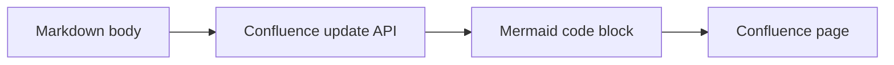

# confluence-mermaid-renderer

Manifest V3 Chrome extension that detects Mermaid-looking Confluence code blocks on Confluence Cloud page views and renders a Mermaid preview below each matching block.

Confluence Cloud may render Mermaid fenced code blocks as `language-text` instead of preserving `language-mermaid` in the page DOM. This extension does not rely only on language metadata; it checks Confluence code block selectors and the leading directive in the source text to identify Mermaid source.

## Requirements

- Node.js
- pnpm 11
- Chrome

## Install

```sh
pnpm install
```

## Build

```sh
pnpm build
```

Build output is written to `dist/`.

The JavaScript bundle is emitted as ASCII-only output so Chrome can load it reliably as a content script.

## Load the extension in Chrome

1. Open `chrome://extensions/`.
2. Enable Developer mode.
3. Click Load unpacked.
4. Select this repository's `dist/` directory.
5. Open or reload a Confluence Cloud page under `https://*.atlassian.net/wiki/*`.

## Test on Confluence

Create or open a Confluence page that contains a code block whose text is Mermaid syntax. The block may be marked as plain text by Confluence.

Example:



On the rendered page, the extension scans code blocks matching selectors such as:

- `[data-testid="renderer-code-block"] code`
- `span[data-code-lang] code`
- `.code-block code`
- `code.language-text`
- `code.language-mermaid`

If the trimmed text starts with a supported Mermaid directive and `mermaid.parse` accepts it, a preview is inserted below the source block. Non-Mermaid text blocks are ignored. Mermaid render errors are shown inline next to the relevant block.

Each rendered preview defaults to fitting the whole diagram into the preview width and height. Fit is recalculated when the preview size changes, such as after resizing the browser window. Use the zoom controls to enlarge or shrink it; when the diagram is larger than the preview viewport, drag inside the preview to pan around it. The Fit button resets the diagram back to the fitted size.

Flowchart labels are rendered as SVG labels instead of HTML labels to reduce clipping caused by host page CSS in Confluence.

## Development

```sh
pnpm format
pnpm format:check
pnpm lint
pnpm typecheck
pnpm build
pnpm check
```

`pnpm check` runs formatting check, lint, TypeScript type checking, and then builds the extension.

The default rendering layout is below the code block because it is less fragile in Confluence page layouts. A side-by-side insertion path exists in the content script and can be enabled by changing `RENDER_LAYOUT` in `src/content.ts` to `"side-by-side"`.

## Security

- Mermaid is bundled locally by the build.
- The extension does not inject CDN scripts.
- The manifest uses no extension permissions.
- The only host permission and content script match target is `https://*.atlassian.net/wiki/*`.
- Mermaid is initialized with `startOnLoad: false` and `securityLevel: "strict"`.

## Limitations

- The preview is visible only to users who have this extension installed.
- The preview does not change Confluence page content.
- The preview does not affect Confluence PDF export or what other users see.
- Confluence Cloud DOM structure may change; selectors may need updates if Atlassian changes rendered code block markup.
